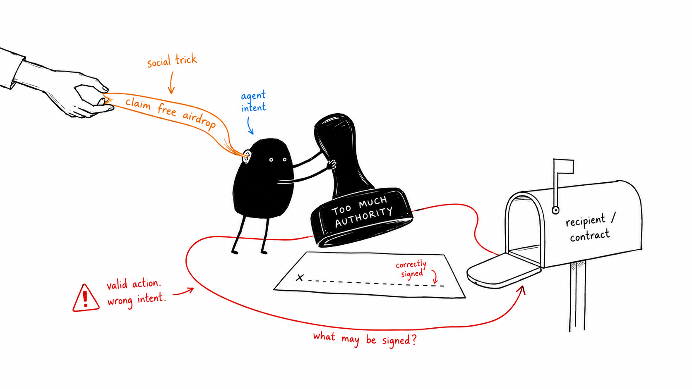
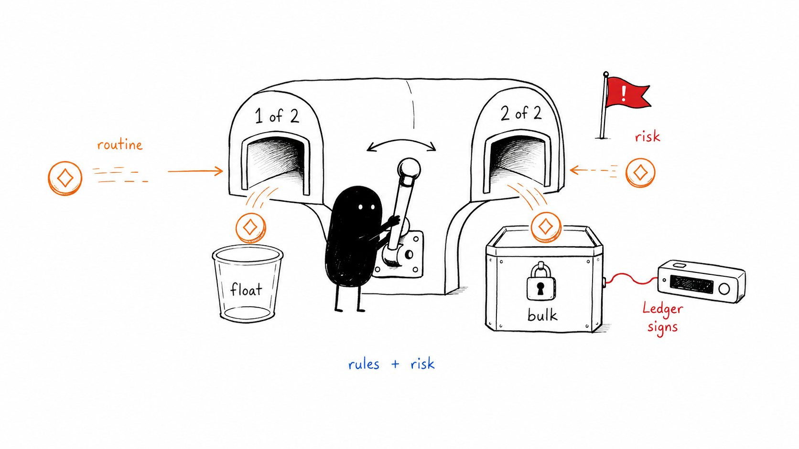

# Puffer

TODO: Add a dashboard field for configuring `notifyUrl`, so users can connect approval alerts to a Slack, Discord, ntfy, or custom webhook without calling the API manually.

**An agent wallet on Sui that is a 1-of-2 most of the time, and a 2-of-2 when it needs to be.**

A pufferfish is unremarkable until something threatens it. Your agent spends freely inside limits
you set; when a transaction falls outside them, it is rebuilt from an address our key cannot move
alone, and it waits for your Ledger.

Sui testnet. Live now:

| | |
|---|---|
| A DeepBook trade the wallet allowed | [`GbCZqDq1wW…`](https://suiscan.xyz/testnet/tx/GbCZqDq1wW31HrPRPnsgw8FMRUFffrseFacoNruLPCKV) — 1.902375 SUI out, 1.3756 DBUSDC back, scored 20/100 |
| A drain the wallet held, co-signed on a Ledger Flex | [`4XMjg6B8…`](https://suiscan.xyz/testnet/tx/4XMjg6B8syvRAL97hNucgxY7sb8btAuPiNWgU1Q5nD4g) — sender the 2-of-2, **two signatures** |

---

## The problem

An agent with a wallet does not get robbed of its keys. It gets *talked into* using authority it
already has. Nothing about that transaction looks stolen — it is correctly signed, by the right key,
doing exactly what the agent asked. Key custody is not the defence, because the key was never the
thing that failed.

So the question is not *who holds the key* but *what is allowed to be signed with it*.



## How it works

Two addresses, both real Sui multisig committees over the same two keys.

| | Committee | Threshold | Holds | Signs |
|---|---|---|---|---|
| **Spending** | platform w1, ledger w1 | **1** | the float | our server key alone |
| **Protected** | platform w1, ledger w1, recovery w2 | **2** | the bulk, and every escalation | our key **and** your Ledger |

A Sui multisig threshold is blake2b-hashed into the address itself, so it can never be conditional.
Puffer uses that rather than fighting it: the conditionality comes from **which address originates
the transaction**. A held payment is rebuilt from the protected address, where validators reject our
signature on its own — `Insufficient weight=1 threshold=2`. The hardware approval is load-bearing,
not ceremonial.

The recovery key carries weight 2 on purpose. A plain 2-of-2 turns a lost Ledger into permanent loss
of everything protected, which is a larger expected loss than the attack being prevented. At weight
2 it can stand in alone, and it never touches a routine spend.



### Judging a transaction

```
typed intent  →  build  →  simulate  →  deterministic rules  →  risk model  →  gate
```

The agent declares a **typed intent** — a recipient, an amount, a pool — and never raw bytes. The
server builds every transaction itself. That is the load-bearing property: a prompt-injected agent
cannot smuggle an arbitrary Move call past the gate, because it never had a way to write one.

Then the chain is asked what the transaction actually does. The simulation is the source of truth
for its effects — who gains and loses each asset, which packages it calls, whether an object or
capability leaves the wallet, and whether it succeeds. Puffer judges those facts in a fixed order,
first match winning:

| | |
|---|---|
| Simulation failed or unreachable | **blocked** |
| `WEEKLY_CAP` | **blocked** — hardware cannot create budget |
| `PER_TX_LIMIT`, `UNKNOWN_RECIPIENT`, `UNKNOWN_PACKAGE`, `CAPABILITY_TRANSFER` | **needs your Ledger** |
| Any Gonka verifier says medium or high, or verifiers disagree | **needs your Ledger** |
| Fewer than two valid Gonka verifier responses | **needs your Ledger** |
| otherwise | **allowed** |

Deterministic rules are a floor. The three currently configured risk reviews — **two MiniMax-M2.7
requests and one DeepSeek-V4-Flash request via Gonka** — can only escalate above them, never clear a rule that fired.
Sui simulation supplies verifiable facts about the proposed transaction; each model supplies its
own assessment of those facts. Bands are ours and published: under 34 low, under 67 medium, else
high. Puffer allows a routine payment only when at least two valid model responses are low risk;
any higher vote or disagreement requires the Ledger.

The model receives the **simulated evidence bundle**, not raw transaction bytes and not a claim
from the agent that a payment is safe. Its input contains balance changes, gas use, Move packages,
object transfers, and simulation status. The agent's stated reason is explicitly marked as
untrusted text. On a real drain MiniMax returned 85/100 and named the manipulation unprompted:

> The "claim free airdrop" text is a social engineering trick with no actual reward.

Puffer sends two MiniMax requests and one DeepSeek request as a connectivity hedge. Every request
disables Gonka fallback; a substituted, malformed, or timed-out response is not a vote. Duplicate
MiniMax responses never count as two independent votes, so a two-model low-risk quorum still
requires both MiniMax and DeepSeek. The receipt shown for each winner includes its `X-Request-Id` and
`X-Devshard-ID`; request IDs can verify Gonka served a call, but do not prove the prompt or response
content until signed receipts are available. The gate never lets a model override a cap,
unfamiliar-recipient rule, package rule, simulation failure, or capability-transfer block.

`CAPABILITY_TRANSFER` is there because balance changes cannot see it: handing over an admin
capability yields a `balanceChanges` array whose only row is gas, so every cap, limit and recipient
rule would pass a total authority handover clean.

### Guardrails are a word, not four numbers

Nobody can pick a per-transaction limit sensibly on their first day, and a bad guess is invisible
until it bites. Ours did: a `0.0025` SUI limit sent every DeepBook trade to the hardware key,
because no fillable trade on that book is smaller than about 1.5 SUI.

| | Reef | Open Water |
|---|---|---|
| Pays unlisted addresses | needs your Ledger | yes |
| Per transaction | 2.5 SUI | 10 SUI |
| Weekly cap | 10 SUI | 50 SUI |
| Simulated | always | always |
| Risk scored | always | always |

A mode widens *who* you can pay and *how much at once*. It never removes a check, and there is no
mode that signs whatever it is handed.

### Raising a limit where you actually are

A payment over the limit used to mean: stop, leave the terminal, open a settings page, invent a new
number, ask the agent to retry. The moment you are being asked is the only moment you have enough
context to answer, so the answer belongs there. An approval now offers to raise the limit or add the
payee, and the tick rides along with the hardware signature.

Three things keep it safe. The **server** proposes the number, derived from the transaction already
in front of you — the request body carries booleans only, so a compromised page has nothing to
inflate. A **Ledger signature must be present**, which makes this a harder way to widen a limit than
the settings page, not a shortcut around one. And the **weekly cap is the ceiling and is never
raisable here**.

---

## Using it

One call, and the agent has everything it needs:

```bash
curl -sX POST $BASE/api/onboard -H 'content-type: application/json' \
  -d '{"agent":"hermes","pass":"'"$ONBOARD_PASS"'"}'
```

It returns a bearer, an MCP config block, and a setup link for you. **The agent prints the link and
stops** — it cannot connect your Ledger (that needs WebHID in a desktop browser) and it cannot write
your policy. Every `/api/setup/*` route rejects a request carrying an `Authorization` header at all,
so an agent that tried would get a 403 before the body was even parsed.

Seven MCP tools, and the list is the whole capability surface:

| | |
|---|---|
| `wallet_status` | balance, guardrails, and a preflight of what will fail before you try it |
| `wallet_markets` | live quotes and the smallest size the book will fill right now |
| `wallet_transfer` · `wallet_swap` | commit — or pass `dry_run: true` to rehearse and discard |
| `wallet_approval_status` | poll a held decision |
| `wallet_history` | past decisions, each with the reason the agent gave |
| `wallet_explain_last` | which rules fired, and why |

Note what is absent: nothing writes policy, nothing approves an approval, and there is no `network`
parameter anywhere — a field that does not exist cannot be prompt-injected or defaulted wrong.

Full curl reference in [CURL.md](CURL.md). Agent-facing notes in [AGENTS.md](AGENTS.md) and
[.claude/skills/puffer-wallet/](.claude/skills/puffer-wallet/).

### When something is held

Puffer posts to any webhook you own — Slack, Discord, ntfy, six lines of your own code. The message
carries a **decline** link that works from any device with no session, and no approve link, because
approving needs the Ledger. That asymmetry is the design: the worst a stolen notification can do is
refuse a payment that was already being questioned.

---

## Running it

Needs Node 24 (for built-in `node:sqlite`) and a `.env` with `ONBOARD_PASS`, `GONKA_API_KEY`,
`SHINAMI_GAS_STATION_ACCESS_KEY`, `PRIVATE_KEY` (a funding wallet) and `PUBLIC_BASE_URL`.

```bash
npm install
ONBOARD_PASS=demo npm run dev          # http://localhost:3000
npm run fund -- 0x<address> 2.5        # testnet's HTTP faucet is IP-blocked; this is the way
bash scripts/flow.sh                   # the whole flow, printing every curl before it runs
npx tsx --test lib/*.test.ts
```

Gas is sponsored by Shinami, so the wallet pays no fees — but the trade principal is always the
agent's own balance. Pages: `/setup`, `/guardrails`, `/test` (the Ledger bench).

## Tech stack used

### Sui

- **Sui gRPC + Programmable Transaction Blocks (PTBs)** — builds and simulates every transaction before it can be signed.
- **Shinami Gas Station** — sponsors gas, so users do not pay transaction fees.
- **DeepBook v3** — provides live market data and executes SUI/DBUSDC trades; Sui gRPC performs the transaction simulation.
- **Ledger + WebHID** — hardware-key signing for protected transactions.
- **Sui native multisig** — 1-of-2 spending and 2-of-2 protected wallets.

### App and AI

- **Next.js 16 + React 19** — web application.
- **Gonka AI Router** — routes the independent MiniMax and DeepSeek transaction-risk reviews.
- **MCP Streamable HTTP** — exposes the agent wallet tools.
- **`node:sqlite` + Zod** — local persistence and runtime validation.

---

## What Puffer does not protect you from

A security product that lists only its strengths is telling you half of something.

- **Us.** The signing key for the spending address lives on our server. Puffer protects you from
  your agent, not from us. The protected address is the part we cannot move alone.
- **A transaction your rules allow.** Allow-list an address, set a high enough cap, and an agent
  talked into paying that address will pay it. The guardrails are yours; so are their gaps.
- **Anything the device cannot render.** The Sui Ledger app clear-signs a small set of transaction
  shapes. We build the readable shape whenever the wallet's funds allow — but a wallet funded so
  that a Move call is unavoidable will show your Ledger a hash, and a hash is not informed consent.
- **A risk model having an off day.** Which is why it can only escalate. Every deterministic limit
  is checked before the model is asked, and it is never consulted to overturn one.

## Known gaps

- One test file. `lib/gate.test.ts` pins the gate's ordering; modes, adjustments, error codes and
  notifications are verified by live runs, not by tests.
- The limit-raise path has never had a real hardware signature through it — the offer and the API
  are verified, the last mile is not.
- Testnet only, and pinned there by a boot assertion on the chain identifier.
- x402 was considered and dropped: it supports Base, Base Sepolia and Solana, and Sui appears
  nowhere in its documentation.
