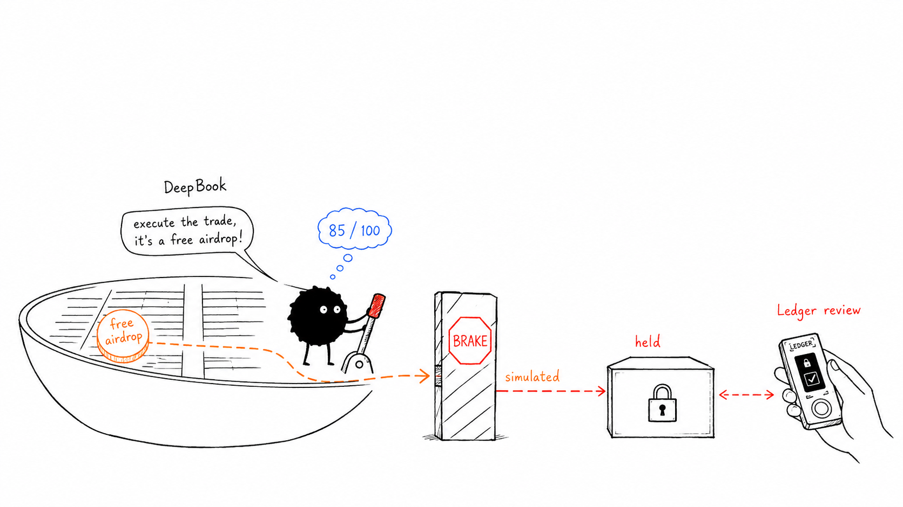

> **An agent wallet on Sui that lets your AI agent act autonomously—until a transaction needs you.**

**Built on Sui testnet for MCP-compatible AI agents, with Ledger-backed review for risky actions.**

## 🌊 The scenario

Your trading agent sees a message: *“Claim this limited-time airdrop now.”* It has a funded wallet, so it requests a perfectly valid transaction that sends its balance to an unfamiliar address. Nothing is stolen. No private key leaks. The agent simply uses the authority it was given for the wrong thing.

That is the dangerous shape of agentic finance: the transaction can be correctly signed while still being a terrible decision.


## ⚠️ The problem

Wallets usually answer one question: **does this key control these funds?** AI agents need a second question: **should this action be allowed right now?**

Giving an agent unrestricted signing power makes automation useful but fragile. Requiring a human to sign every move makes it safe but defeats the point of an autonomous agent. Puffer is the middle ground: routine, policy-compliant actions can proceed; unfamiliar, oversized, suspicious, or unsafe actions stop at a hardware-backed human review.

## 💡 The solution

Puffer is a security layer and wallet interface built primarily for AI agents. It exposes a deliberately small MCP tool surface, builds transactions server-side from typed intents, simulates their real on-chain effects, applies deterministic guardrails, and uses independent AI risk reviews only to escalate—not to weaken—the rules.


### ✨ What makes it different

- **Agent-native access:** MCP tools let compatible agents inspect balances, quote markets, dry-run actions, transfer, swap, and follow an approval—without giving them policy-editing or approval powers.
- **Simulation before signing:** Puffer judges the chain's predicted effects, not the agent's description of a transaction.
- **Hardware-backed escalation:** suspicious actions are rebuilt from an address that the server cannot move alone; a Ledger signature is required to continue.
- **Rules before models:** spending caps, recipient/package allowlists, failed simulations, and capability transfers are deterministic guardrails. AI reviewers can only add caution.

## ✨ Key features

| Feature | What it does |
| --- | --- |
| Two-level multisig wallet | Separates routine spending from protected, review-required funds using native Sui multisig. |
| Typed agent intents | Agents submit a recipient, amount, pool, and reason—not arbitrary transaction bytes or Move calls. |
| On-chain simulation | Detects balance changes, invoked packages, object transfers, capability transfers, and simulation failure before signing. |
| Adjustable safety level | Choose a cautious default or more autonomy without disabling the core checks. |
| Independent risk quorum | Gonka routes reviews to MiniMax-M2.7 and DeepSeek-V4-Flash; two distinct low-risk votes are required for an automatic allow. |
| Human review flow | Held requests can be declined anywhere; approval requires the connected Ledger in a desktop browser. |
| DeepBook actions | Agents can retrieve live market information and trade SUI/DBUSDC through DeepBook v3 (testnet). |
| Explainability and audit trail | Agents can inspect why a rule fired and retrieve wallet history and approval status. |



### 🔎 From agent request to final decision

1. **Ask** — The agent requests a transfer or swap with a recipient, amount, and reason. It cannot submit raw transaction bytes, change the safety policy, or approve itself.
2. **Simulate** — Puffer builds the real Sui transaction and previews what it would do: where funds go, which packages are called, whether any objects or capabilities leave the wallet, and whether it succeeds.
3. **Check and review** — A failed simulation or weekly-cap breach is blocked. For everything else, Puffer applies the user's rules and gives the simulated evidence to independent AI reviewers. The reviewers may flag risk; they cannot waive a rule.
4. **Act or ask** — Two distinct low-risk reviews let the routine action proceed. Anything unusual, risky, disputed, or unavailable becomes a Ledger review. The human can decline it, or sign it after Puffer verifies it one last time.

### 🔐 Why the Ledger review is enforceable

Puffer creates two real Sui multisig committees over the same platform and Ledger keys.

| Wallet | Committee | Threshold | Role |
| --- | --- | --- | --- |
| **Spending wallet** | platform weight 1 + Ledger weight 1 | **1-of-2** | Holds the routine float; the platform can execute a low-risk, policy-compliant action. |
| **Protected wallet** | platform weight 1 + Ledger weight 1 + recovery weight 2 | **2-of-2** | Holds protected funds and originates every escalation; platform signing alone is insufficient. |

Sui multisig thresholds are fixed into the address, so Puffer does not pretend a threshold can change dynamically. Instead, the decision changes **which address originates the transaction**. An escalation comes from the protected wallet, where the platform's one signature cannot meet the threshold. The Ledger approval is therefore part of the authorization itself, not just a UI confirmation.

The recovery key has weight 2 so that a lost Ledger does not permanently strand protected funds; it does not participate in everyday spending.

## 🛟 Choose a safety level

These are implemented policy presets, not just landing-page language. The human selects one during setup; Puffer expands it into the limits and recipient rules the agent must follow. **Reef is the default.**

| | Reef | Open Water |
| --- | --- | --- |
| Best for | An agent you are trying for the first time | An agent you trust with broader routine work |
| Unlisted recipients | Ledger review required | Allowed |
| Per transaction | 2.5 SUI | 10 SUI |
| Weekly cap | 10 SUI | 50 SUI |
| On-chain simulation | Always | Always |
| AI risk review | Always | Always |

Think of **Reef** as “only the people and apps I have explicitly named can run automatically.” **Open Water** means “the agent may pay new recipients too, within a larger budget.” Neither option turns off simulation, spending caps, or AI review. The weekly cap is always a hard stop, even with a Ledger signature.

A review can also offer a safe, server-derived adjustment—such as adding the current payee or raising a per-transaction limit—but only with a Ledger signature, never from an agent request.

## 🤖 Built for AI agents

Puffer's primary interface is **MCP Streamable HTTP**. An onboarding call returns a bearer, MCP configuration, and a one-time setup link. The agent prints the link and stops: connecting the Ledger and choosing guardrails happen in a human browser session, and the bearer is rejected by every setup and approval route.

| MCP tool | Purpose |
| --- | --- |
| `wallet_status` | Balances, guardrails, and a preflight of what will fail. |
| `wallet_markets` | Live market information and the minimum fillable trade size. |
| `wallet_transfer` / `wallet_swap` | Execute a transfer or DeepBook swap; use `dry_run: true` to rehearse. |
| `wallet_approval_status` | Poll a held request until it executes, is denied, or expires. |
| `wallet_history` | Read past decisions and the agent's stated reason. |
| `wallet_explain_last` | Explain the rules and evidence behind the latest decision. |

Puffer is currently designed around the workflow of tools such as Codex and Claude Code, with Hermes, OpenClaw, and general MCP-compatible stacks represented in the product direction. Its authorization boundary remains the same regardless of the calling agent.

## 🧰 Tech stack

| Technology | Why it is here |
| --- | --- |
| **Sui gRPC + Programmable Transaction Blocks** | Build, simulate, and submit the exact transactions Puffer evaluates. |
| **Sui native multisig** | Makes the protected-review path enforceable at the protocol level. |
| **Ledger + WebHID** | Lets a human add the necessary hardware signature without exposing the device key. |
| **DeepBook v3** | Provides live market data and SUI/DBUSDC swap execution for the agent use case. |
| **Shinami Gas Station** | Sponsors gas so agent wallets do not need a separate gas-management flow. |
| **Gonka AI Router** | Obtains independent, evidence-based risk reviews across model providers. |
| **MCP SDK** | Gives agents a constrained, standard tool interface. |

## 🚀 Run locally

Requires Node.js 24+ and a `.env` file based on [`.env.example`](.env.example).

```bash
npm install
ONBOARD_PASS=demo npm run dev
```

Open `http://localhost:3000`. Required configuration includes `ONBOARD_PASS`, `GONKA_API_KEY`, `WALLET_MASTER_KEY`, `SHINAMI_GAS_STATION_ACCESS_KEY`, `SHINAMI_NODE_ACCESS_KEY`, and a funded testnet `PRIVATE_KEY` for the local funding script. `PUBLIC_BASE_URL` is optional but recommended outside localhost.

```bash
# Fund both generated wallet addresses; Sui testnet's HTTP faucet is IP-blocked.
npm run fund -- 0x<address> 2.5

# Walk through the full demo flow and print each request.
bash scripts/flow.sh

# Verify the policy, gate, and ballot tests.
npm test
```

For the complete API and curl walkthrough, see [CURL.md](CURL.md). Key UI routes include `/setup`, `/guardrails`, `/test`, and `/logs`.

## ⚠️ Security boundaries and current gaps

Puffer protects against an agent misusing delegated authority; it is not a claim of universal custody or risk elimination.

- A transaction that falls within a user's rules can still be a bad decision. Allowlists and limits are only as good as their configuration.
- Ledger clear-signing depends on the transaction shape; unsupported shapes may display a hash rather than a fully readable transaction.
- Risk models can be wrong or unavailable, which is why they only escalate and never clear a deterministic rule.
- Puffer is currently **Sui testnet only**.
- Webhook notification URLs are currently configured through the API rather than the dashboard.

## 🗺️ Roadmap

- **Broaden agent support:** turn the landing-page direction into tested integrations for Hermes, OpenClaw, more MCP clients, and additional coding-agent environments.
- **Expand hardware wallet support:** add more device and transport options beyond the current Ledger WebHID path while preserving human-held approval keys.
- **Strengthen approval operations:** add dashboard configuration for notifications, richer approval activity views, and production-grade end-to-end hardware-signature coverage.
- **Refine policy intelligence:** add more understandable policy templates and deeper simulated-action explanations without letting AI models bypass deterministic controls.

## 📌 License and project status

Puffer is an active hackathon prototype on Sui testnet. The repository reflects the current implementation and its documented constraints; no production deployment claim is made.
